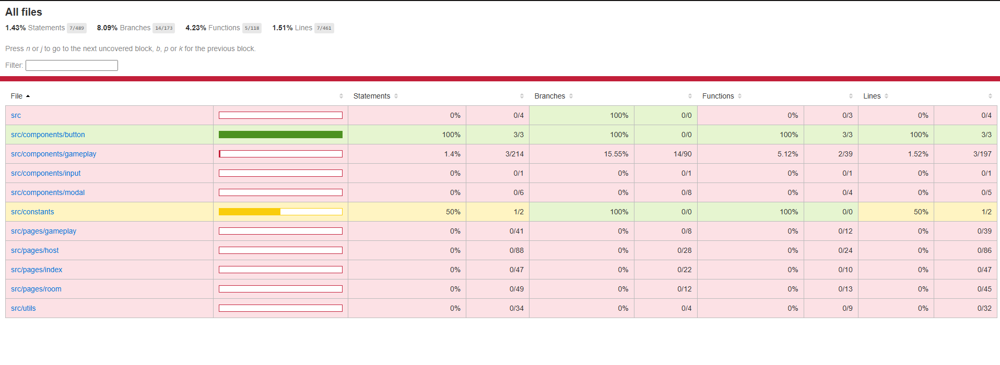
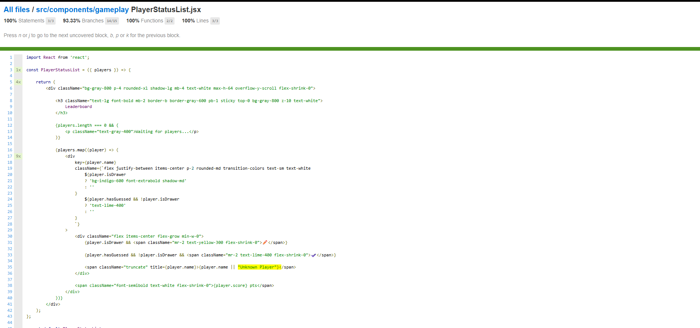
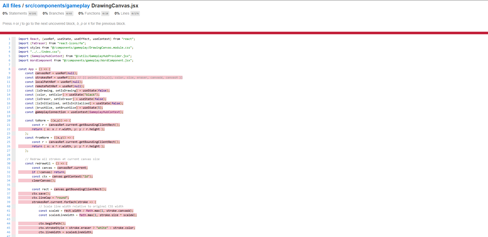

# How to use/write Unit Tests
## 1. Vitest, Assertions, and Mocks Basics
### Installation
Run inside draw.it.client:
```
npm install -D vitest
````


### Assertions
```js
expect(result).toBe(5);
expect(screen.getByText('Player Name')).toBeInTheDocument();
expect(element).toHaveClass('font-extrabold');
expect(() => badCall()).toThrow('Invalid input');
```

### Mocks
```js
const mockFn = vi.fn();
render(<MyButton onClick={mockFn}>Click</MyButton>);
fireEvent.click(screen.getByText('Click'));
expect(mockFn).toHaveBeenCalledTimes(1);
```

## 2. Use the AAA (Arrange – Act – Assert) Principle

### Arrange
```js
const mockData = [{ name:'Jonas', score:5 }];
render(<SomeComponent data={mockData} />);
```

### Act
```js
fireEvent.click(screen.getByRole('button',{ name:/Add/i }));
```

### Assert
```js
expect(screen.getByText('Jonas')).toBeInTheDocument();
const row = screen.getByText('Jonas').closest('div');
expect(row).toHaveClass('border-2');
```

## Run the Tests
Run from `draw.it.client`:

| Command | Purpose |
|--------|----------|
| `npm run test` | Watch mode |
| `npm run test -- --run` | Single run |
| `npm run test -- --coverage` | Coverage |
Coverage output goes to `draw.it.client/coverage/`.

---
## Coverage HTML Report


### Colors
- **Green** – good. Code is covered by tests. Usually 80–100%.
- **Yellow** – medium. Partially tested. Usually 40–79%.
- **Red** – poor. Barely or not tested. 0–39%.

### Percentage Metrics
Each column shows a different dimension:

#### Statements
How many simple code statements are executed during tests.  
Example: `2/40` means only 2 statements were actually reached during testing.

#### Branches
How many “branches” were tested: `if`, `else`, ternary operators, switch-case.  
Example: `1/6` → only one logical branch was executed.

#### Functions
How many functions were run during tests.  
Example: `0/8` → tests did not execute any functions.

#### Lines
How many physical lines of code were executed during tests.  
Example: `4/198` → only 4 actual lines were reached.

### File List
On the left, you see folders and files.  
The color indicates their overall test coverage.

Examples:
- **100% green** – file has excellent test coverage.
- **50% yellow** – only part of the logic is tested.
- **0% red** – no testing at all.

### Example screenshots:
Basic view


